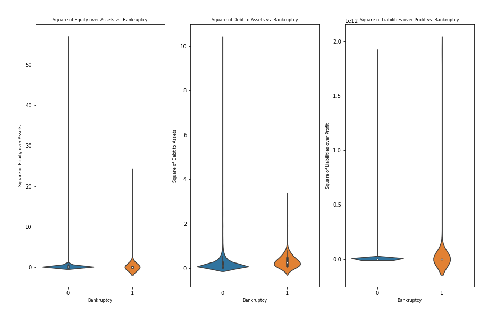
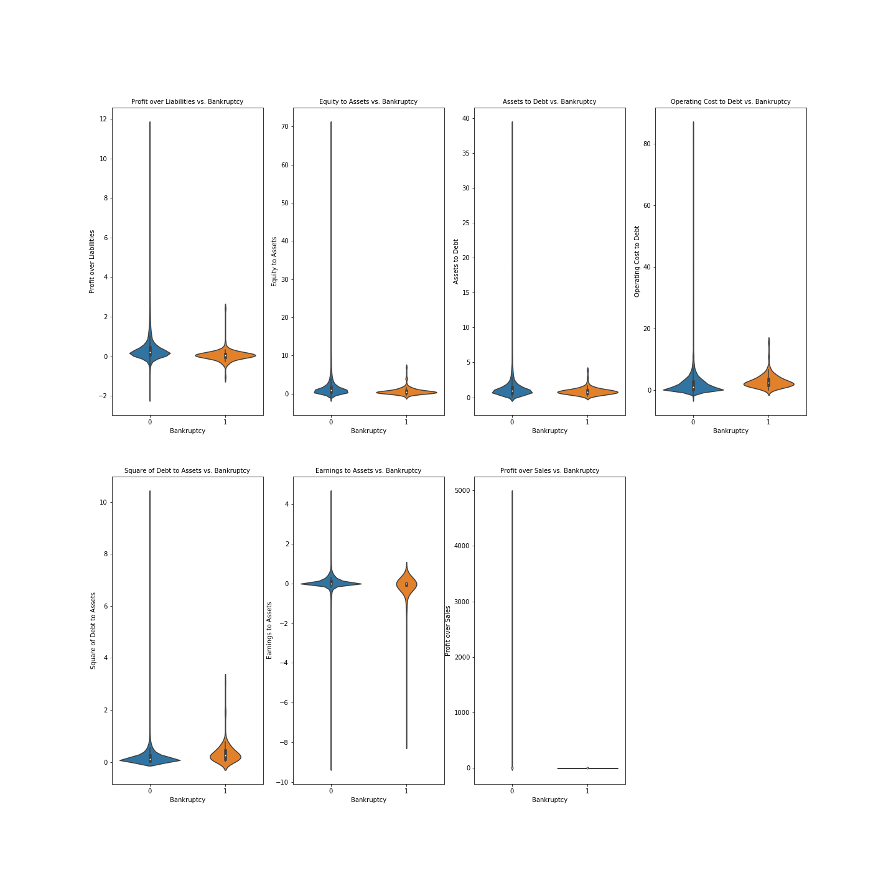

# Bankruptcy Predictor README

**Authors**: Ben Spilsbury, Jake Oddi

## Overview

This project analyzes business fundamental data of many companies during one year of operation in order to predict which of those companies later on went bankrupt. An ensemble model is created out of logistic regression and random forest models in order to perform these predictions. As a product of the project, a model is produced that financial groups could use in order to assess risk of investment in a given company, based on whether or not it was predicted that company would go bankrupt.

## Business Problem

As much of corporate financial investment revolves around the accurate prediction of a company's performance, any sort of tool used to assess a company's future state is incredibly useful. As such, the data science team set out to create a tool that would predict an extreme case in a company's future, its bankrupty. With dependable information about a company's impending bankruptcy, investors could either know to avoid bullish positions or to, conversely, take bearish positions in that company. What is more, with dependable bankruptcy forecasting, financial institutions could better evaluate and target the future acquisition of certain companies, if it were desired to do so after those companies' bankruptcies. Lastly, by creating a dependable model, the team can determine which financial indicators are most influential in determining whether or not a company will go bankrupt.

## Data

Financial data on Polish companies operating between 2007 and 2013 was used. This data was obtained via the University of California at Irvine's machine learning repository. Its ultimate source is the Emerging Markets Information Service.

Only one year was examined (2010), which had 10,503 data points. Data includes 64 features all gauging financial fundamentals (e.g. debts-to-assets ratio, etc.).

Bankruptcy target variable determines whether or not each of the 10,503 companies went bankrupt after 3 years.


## Methods

Data was first cleaned. Three extra features were engineered in order to more heavily weight variables with high correlations to target variable.



KNN, Logistic Regression, Decision Tree, and Random Forest models were all created and evaluated individually based on F1-score and precision. Ensemble models of all combinations of individual models were evaluated in the same way. The model with highest F1-score and precision ratings was deemed best, and its constituents models' most influential features were found.

## Results

Model with the best F1-score and precision values (~0.94 and 1.0, respectively) was the ensemble model of the Logistic Regression, Decision Tree, and Random Forest models. These values indicate high model performance on the test data. The most important features of this model that predicted bankruptcy were as follows:
    - (gross profit + depreciation) / total liabilities
    - book_value_equity_to_assets
    - current_assets_to_total_debt
    - operating_costs_to_total_debt
    - current_debt_to_total_assets SQUARE
    - retained_earnings_to_assets
    - (gross profit + depreciation) / sales




## Conclusions

For best predictions on a company's potential future bankruptcy, an ensemble composed of logistic regression, decision tree, and random forest models performs best.

Based on analyzed feature importances, leverage and liquidity appear to be the most indicative of a company’s financial health and theoretical impending bankruptcy.

For next steps, the analysis should be expanded to include more global companies (and not just Polish ones) in order to make the model more all encompassing. 


## For More Information

Please review our full analysis in [our Jupyter Notebook](./Bankruptcy_Predictor.ipynb) or our [presentation](./Bankruptcy_Predictor_Slides.pdf).

For additional info, contact Ben Spilsbury or Jake Oddi at
[benjamin.spilsbury@gmail.com](mailto:benjamin.spilsbury@gmail.com) or [jakeoddi@gmail.com](mailto:jakeoddi@gmail.com.edu), respectively

## Repository Structure

Describe the structure of your repository and its contents, for example:

```
├── README.md                           <- The top-level README for reviewers of this project
├── Bankruptcy_Predictor.ipynb          <- Narrative documentation of analysis in Jupyter notebook
├── Bankruptcy_Predictor_Slides.pdf     <- PDF version of project presentation
├── data                                <- source data used for analysis
└── pictures                            <- saved graphs
```
